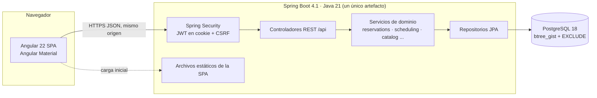
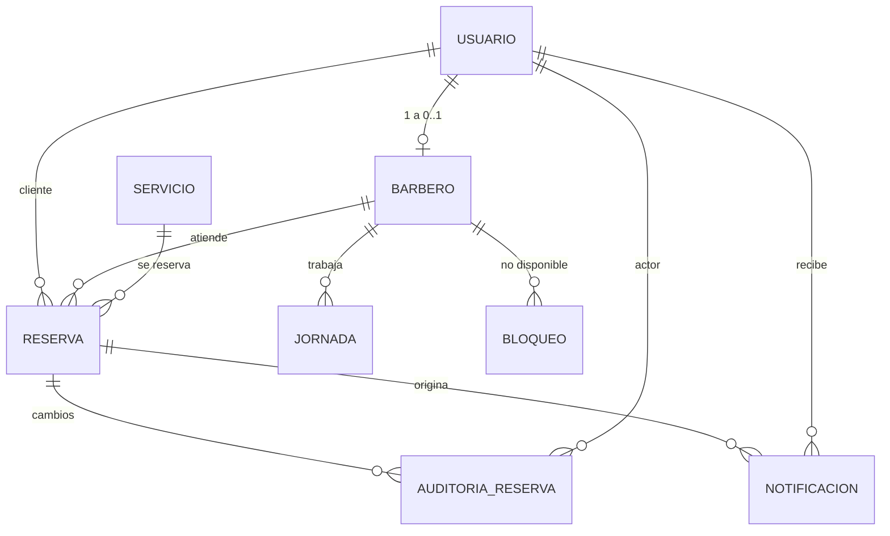

# BarberTurno — Arquitectura

> Versión 1.0 · 01/10/2026 · Responsable: Claude Code (arquitecto)
> Relacionados: [requisitos.md](requisitos.md) · [tareas.md](tareas.md) · [../AGENTS.md](../AGENTS.md)
> Notación de fuentes: igual que en requisitos.md §0 (`[Inf p. N]`, `[Proto]`, `[Drawio:…]`, `[Corrida:…]`).

## 1. Resumen

Se implementa la **alternativa A1** del APF2 [Inf p. 10, 23, 28]: una **SPA Angular** para la presentación y un **monolito modular Spring Boot (Java)** que concentra la autenticación, la autorización, las reglas de negocio, las transacciones, la persistencia y los reportes sobre **PostgreSQL**. La SPA no contiene reglas de negocio: solo valida formularios para mejorar la experiencia y siempre confía en la respuesta del servidor [Inf p. 6, 33].



**Por qué un monolito modular:** hay un solo desarrollador, una sede y un volumen de decenas de reservas al día (S-06). Un único proceso y una única base de datos permiten **transacciones ACID** que cubren reserva + auditoría + aviso [Inf p. 28], que es justo lo que exige RNF-05. Los módulos por funcionalidad mantienen la separación de responsabilidades del diagrama de clases [Inf p. 26] sin el coste operativo de los microservicios.

---

## 2. Tecnologías y versiones (verificadas el 01/10/2026)

| Componente | Versión elegida | Verificación en la fuente oficial | Motivo |
|---|---|---|---|
| Java | **21 LTS** (Temurin 21.0.8, ya instalado) | Spring Boot 4.1.1 admite Java 17–26 (docs.spring.io/spring-boot/system-requirements.html) | LTS soportada y ya presente en el equipo. El anexo del APF2 (JDK 17) es compatible. Java 25 LTS sería una alternativa válida, pero no aporta nada necesario al MVP. |
| Spring Boot | **4.1.1** (Spring Framework 7.0.x, Spring Security 7, Hibernate 7.4, Tomcat 11) | spring.io/projects/spring-boot. Soporte OSS de la rama 4.1 hasta el 31/07/2027 (endoflife.date) | Rama vigente con soporte durante todo el curso. La 3.5 ya no tiene soporte OSS (fin 30/06/2026). |
| Build backend | **Maven Wrapper** (Maven 3.9.x) | Boot 4.1 requiere Maven ≥ 3.6.3 | Maven no está instalado; el wrapper evita instalarlo y fija la versión. |
| Migraciones | Flyway 12.4 (gestionado por Boot) + `spring-boot-starter-flyway` | Coordenadas de dependencias de Boot 4.1.1. En Boot 4, Flyway necesita su starter dedicado (guía de migración a 4.0) | Esquema versionado y reproducible. |
| Driver | PostgreSQL JDBC 42.7.13 (gestionado) | Coordenadas de Boot 4.1.1 | — |
| Documentación API | springdoc-openapi **3.1.1** (`springdoc-openapi-starter-webmvc-ui`) | springdoc.org: la línea 3.x es la que soporta Spring Boot 4. 3.1.1 es la última en Maven Central (comprobado el 01/10/2026) | Swagger UI solo en `dev` y para la sustentación. T-02 comprueba que funciona con 4.1.1. |
| Cobertura | JaCoCo **0.8.15** (`jacoco-maven-plugin`, no gestionado por Boot) | Maven Central, release 0.8.15 (comprobado el 01/10/2026) | RNF-10. |
| Base de datos | **PostgreSQL 18** (versión mayor fija). Parche objetivo: la última menor publicada (**18.6** al 01/10/2026). **Entorno local real: 18.6** desde el 04/10/2026 (T-38; servicio `postgresql-x64-18`, **puerto 5433**, cliente `C:\Program Files\PostgreSQL\18\bin\psql.exe`) | postgresql.org/support/versioning: la rama 18 tiene soporte hasta el 14/11/2030. postgresql.org/support/security: de 18.1 a 18.6 se corrigen unos 46 CVE (no existe la 18.5) | Versión mayor actual. La extensión `btree_gist` es *trusted*: la puede crear el dueño de la base de datos (comprobado en 18.0 con el rol de aplicación, revisión de T-01). Política de versiones menores en DA-16. |
| Frontend | **Angular 22** (CLI 22.2.0, core y Material 22.2.1 en npm), TypeScript 6.0 (`>=6.0 <6.1`), angular-eslint 22.5.0, Prettier 3, Vitest (peer `^4.0.8 \|\| ^5`) | angular.dev/reference/releases: 22 está en estado *Active* (publicada el 03/06/2026, LTS hasta 06/2028). Versiones de npm comprobadas el 01/10/2026 | Versión activa. La 21 pasa a LTS. |
| Node.js | **24.21.0 LTS** (cumple ≥ 24.15), instalado con **fnm** solo para el proyecto (`.node-version`, DA-18) | `engines` de `@angular/cli@22.2.0` y `@angular/core@22.2.1`: `^22.22.3 \|\| ^24.15.0 \|\| >=26.0.0`. nodejs.org: la 24.21.0 es la última 24 (07/09/2026); la 24 tiene soporte hasta el 30/04/2028 | **Entorno real (01/10/2026):** Node del sistema 20.19.0 (nvm de Herd, fuera de soporte desde el 30/04/2026); nvm tiene además 24.0.2 y 22.22.0; fnm 1.38.1 tiene 22.16.0. **Ninguna cumple:** hay que instalar la 24.21.0 antes de T-03. |
| Estilos (T-48, DA-24) | **Tailwind CSS 4.3.3** con `@tailwindcss/postcss` 4.3.3 y `postcss` 8.5.29, junto a Angular Material 22.2 | npm (comprobado el 05/10/2026; `tailwindcss` publicado el 25/09/2026). Integración según angular.dev/guide/tailwind (`.postcssrc.json` con `@tailwindcss/postcss`) | Utilidades para maquetación y componentes propios; Material conserva sus componentes y se tematiza con sus tokens. |
| Tipografías (T-48, DA-24) | `@fontsource-variable/big-shoulders` 5.3.0 (títulos y horas) y `@fontsource-variable/atkinson-hyperlegible-next` 5.3.0 (texto) | npm (comprobado el 05/10/2026). Big Shoulders es la familia vigente de Google Fonts (ejes `opsz` y `wght`); sustituye a «Big Shoulders Display» | Autoalojadas: la CSP de T-33 y AGENTS.md §4 no admiten fuentes de servicios externos. |
| Pruebas frontend | Vitest (runner por defecto de Angular CLI), Playwright para E2E | — | — |
| Pruebas backend | JUnit 6, AssertJ, Mockito (gestionados por Boot 4.1.1), JaCoCo | Coordenadas de Boot 4.1.1 | — |
| Carga | Gatling (DSL Java, plugin Maven) | — | No requiere instalar nada fuera de Maven. Ver DA-14. |

**Versiones efectivas del backend (resueltas en T-02 y reverificadas en su revisión):** Spring Boot 4.1.1, Spring Framework 7.0.9, Spring Security 7.1.1, Hibernate 7.4.5.Final, Flyway 12.4.0, PostgreSQL JDBC 42.7.13, JUnit Jupiter 6.0.3, Surefire 3.5.6, springdoc 3.1.1, JaCoCo 0.8.15, Maven 3.9.16 con Maven Wrapper 3.3.4 (`only-script`).

> **Cambios de Spring Boot 4 que Codex debe tener en cuenta:** el starter web se llama `spring-boot-starter-webmvc`; el de JWT, `spring-boot-starter-security-oauth2-resource-server`; Flyway necesita `spring-boot-starter-flyway`; Jackson 3 usa el paquete `tools.jackson`; `@SpringBootTest` ya no configura MockMvc por sí solo (hay que añadir `@AutoConfigureMockMvc`). **Generar el proyecto con Spring Initializr para Boot 4.1.1** y no escribir las coordenadas de memoria. *(Comprobado el 01/10/2026: Initializr ofrece 4.1.1 como versión por defecto y Java 21. Los identificadores `web, validation, data-jpa, postgresql, flyway, security, oauth2-resource-server, actuator` generan `spring-boot-starter-webmvc`, `-flyway`, `-security-oauth2-resource-server`, `flyway-database-postgresql` y sus starters de prueba `*-test`, además del Maven Wrapper.)*

---

## 3. Estructura del repositorio

```
BarberTurno/
├── AGENTS.md                 Instrucciones comunes (Claude Code + Codex)
├── CLAUDE.md                 Importa AGENTS.md + rol de arquitecto
├── README.md                 Arranque rápido (lo crea T-01)
├── .editorconfig  .gitattributes  .gitignore
├── .github/workflows/ci.yml  CI (T-04)
├── docs/
│   ├── apf2/                 Material original del APF2 — SOLO LECTURA
│   ├── requisitos.md  arquitectura.md  tareas.md
│   ├── despliegue.md         Guía de despliegue (T-33)
│   └── pruebas/              Evidencias de CP-xx, reportes de cobertura, carga y % Java
├── backend/                  Spring Boot (Maven Wrapper)
│   ├── pom.xml  mvnw  mvnw.cmd  .mvn/
│   └── src/
│       ├── main/java/pe/barberturno/
│       │   ├── BarberTurnoApplication.java
│       │   ├── common/       config, error, time, web, security
│       │   ├── auth/         registro, login, sesión, JWT, contraseñas
│       │   ├── users/        Usuario, perfil, gestión administrativa
│       │   ├── catalog/      Servicio
│       │   ├── scheduling/   Barbero, Jornada, Bloqueo, disponibilidad
│       │   ├── reservations/ Reserva, reglas, estados, operaciones
│       │   ├── audit/        AuditoriaReserva
│       │   ├── notifications/Notificacion
│       │   ├── reporting/    Reportes
│       │   └── demo/         Datos de demostración (perfil demo)
│       ├── main/resources/
│       │   ├── application.yml  application-{dev,test,demo,prod}.yml
│       │   └── db/migration/V1__esquema_inicial.sql …
│       └── test/java/pe/barberturno/…   (espejo de main + support/)
├── frontend/                 Angular 22 (npm)
│   ├── angular.json  package.json  proxy.conf.json  eslint.config.js
│   ├── src/app/{core,shared,features}/
│   └── e2e/                  Playwright
├── perf/                     Simulaciones Gatling (proyecto Maven aparte)
├── tools/                    medir-java.mjs, respaldo.sh, restaurar.sh, db-local.sql, barberturno.env.example
└── .local/                   (ignorada por Git) secretos y pgpass locales; nunca se versiona
```

---

## 4. Módulos

### 4.1 Backend (paquete raíz `pe.barberturno`)
Se respetan los paquetes que anunciaba el APF2 (`auth`, `users`, `catalog`, `scheduling`, `reservations`, `reporting`) [Inf p. 26] y se añaden `audit`, `notifications`, `common` y `demo`. Dentro de cada módulo la estructura es **plana**: entidad, repositorio, servicio y controlador, más un subpaquete `dto` con *records*. Las clases de dominio llevan **nombres en español**, con los sufijos técnicos habituales (`ReservaService`, `ReservaRepository`), igual que en el diagrama de clases [Drawio:Clases].

| Módulo | Clases principales | Responsabilidad | RF |
|---|---|---|---|
| `common` | `TiempoNegocio` (zona Lima, conversiones), `ClockConfig`, `ErrorCodigo`, `NegocioException`, `ManejadorErrores` (`@RestControllerAdvice` → `ProblemDetail`), `PaginaDto`, `SecurityConfig`, `UsuarioActual` | Infraestructura transversal | — |
| `auth` | `AuthController`, `AuthService`, `JwtService` (emisión y validación), `CookieSesion`, `PoliticaPassword`, `AdminInicialRunner` | Registro, login, logout, sesión, cambio de contraseña, bloqueo por intentos, administrador inicial | RF-01, 02, 15 |
| `users` | `Usuario`, `Rol`, `UsuarioRepository`, `PerfilController`, `PerfilService`, `UsuarioAdminController` | Perfil propio, búsqueda y restablecimiento por el administrador | RF-03, 19 |
| `catalog` | `Servicio`, `ServicioRepository`, `ServicioService`, `ServicioController` | Catálogo | RF-04 |
| `scheduling` | `Barbero`, `Jornada`, `Bloqueo`, sus repositorios, `BarberoService`, `JornadaService`, `BloqueoService`, **`CalculadoraFranjas`** (pura), **`DisponibilidadService`** (`consultarFranjas`, `validarFranja`), controladores | Personal, horarios y disponibilidad | RF-05, 06, 07, 20, 21 |
| `reservations` | `Reserva`, `EstadoReserva` (con la máquina de estados), **`ReglasTemporales`** (porte del anexo Java [Inf p. 37]), `ReservaRepository` (`buscarSolapamientos`…), **`ReservaService`** (`crear`, `reprogramar`, `cancelar`, `transicionar`), `ReservaConsultaService`, `ReservaAutorizacion`, `ReservaController` | Núcleo transaccional | RF-08…13, 18 |
| `audit` | `AuditoriaReserva`, `AccionAuditoria`, `AuditoriaRepository`, `AuditoriaService` (`registrarCambio`) | Trazabilidad | RF-17 |
| `notifications` | `Notificacion`, `NotificacionRepository`, `NotificacionService` (`notificar`, `listar`, `marcarLeida`), `NotificacionController` | Avisos internos | RF-16 |
| `reporting` | `ReporteService`, `ReporteController`, `ResumenReporteDto` | Conteos agregados | RF-14 |
| `demo` | `DatosDemoRunner` (`@Profile("demo")`) | Escenario del prototipo y la corrida | — |

Dependencias permitidas: `reservations → scheduling, catalog, users, audit, notifications`; `scheduling → reservations` **solo** a través de `ReservaRepository` (conflictos de jornadas y bloqueos) y de la clase pura `ReglasTemporales` (la usa `CalculadoraFranjas` para `seSolapan`; hallazgo de T-09); `reporting → reservations`; todos → `common`. No se permiten ciclos entre servicios. `AuditoriaService` y `NotificacionService` no dependen de `ReservaService`.

**Reglas puras** (sin Spring y probadas al 100 %): `ReglasTemporales` (`calcularFin`, `seSolapan`, `puedeModificar(ahora, inicio, esAdmin, motivo)`), `EstadoReserva.puedePasarA(destino)`, `CalculadoraFranjas.calcular(...)`, `PoliticaPassword.validar(...)`. Esto cumple RNF-10 y conserva el anexo del APF2 como base del dominio.

**Convenciones Java:** constructores con inyección (sin `@Autowired` en campos); DTO como `record` con Bean Validation; **sin Lombok ni MapStruct** (DA-09); mapeo explícito con métodos estáticos `desde(entity)`; `@Transactional` solo en los servicios; `spring.jpa.open-in-view=false`; Javadoc útil en todas las clases y métodos públicos o protegidos (RA-05), verificado por `doclint` en `verify` (DA-20).

### 4.2 Frontend (Angular 22, componentes *standalone*, signals, sin zone.js)
```
src/app/
├── core/       api/ (un servicio HttpClient por recurso), auth/ (SesionService con signals, guards authGuard/rolGuard,
│               interceptor de errores), modelos/ (interfaces TS espejo de los DTO), tiempo/ (pipe fechaLima, utilidades)
├── shared/     estado-reserva-chip, confirmar-dialogo, motivo-dialogo, vacio/cargando, validadores de formulario
├── layout/     shell con barra superior (contador de avisos; para BARBERO abre el panel de avisos, DA-25) y navegación según el rol
└── features/
    ├── auth/         ingresar, registro, cambiar-password                         (P01)
    ├── perfil/                                                                    (P01)
    ├── reservar/     asistente de 3 pasos: servicio+barbero → fecha+franja → revisar (P02)
    ├── mis-citas/    lista, filtros, reprogramar/cancelar, avisos                 (P03)
    ├── agenda/       día/semana, transiciones, diálogo de auditoría               (P04)
    └── admin/        servicios (P05), barberos (P06), horarios (P07), reportes (P08), usuarios (RF-18/19)
```

| Ruta | Acceso | Pantalla |
|---|---|---|
| `/ingresar`, `/registro` | público | P01 |
| `/reservar` | público para explorar; confirmar exige sesión de CLIENTE o ADMIN | P02 |
| `/cambiar-password`, `/perfil` | autenticado | P01 |
| `/mis-citas` | CLIENTE | P03 |
| `/agenda` | BARBERO, ADMIN | P04 |
| `/admin/servicios`, `/admin/barberos`, `/admin/horarios`, `/admin/reportes`, `/admin/usuarios` | ADMIN | P05–P08 |

Tras el login se navega a `/reservar` (CLIENTE) o `/agenda` (personal), igual que el prototipo. Si `debeCambiarPassword` es verdadero, el guard obliga a pasar por `/cambiar-password`. Rutas *lazy* por funcionalidad. Todas las fechas se formatean con `Intl.DateTimeFormat('es-PE', { timeZone: 'America/Lima' })` (RNF-13). Los guards son **solo de experiencia de usuario**: la seguridad la impone el servidor [Inf p. 6].

---

## 5. Modelo de datos

Parte del E-R del APF2 [Drawio:Datos], [Inf p. 27] y añade columnas para las mejoras. Las convenciones son: identificadores `bigint GENERATED ALWAYS AS IDENTITY`; nombres en español y `snake_case`; instantes en `timestamptz` (DA-04); dinero en `numeric(8,2)`; enumerados como `varchar` + `CHECK` (legibles en SQL y mapeados con `@Enumerated(STRING)`). `creado_en` y `actualizado_en` los asigna la aplicación con el `Clock` inyectado, para que las pruebas sean deterministas.



### 5.1 DDL de referencia (`V1__esquema_inicial.sql`)
```sql
CREATE EXTENSION IF NOT EXISTS btree_gist;

CREATE TABLE usuario (
  id                      bigint GENERATED ALWAYS AS IDENTITY PRIMARY KEY,
  nombre                  varchar(100) NOT NULL,
  correo                  varchar(254) NOT NULL,
  telefono                varchar(9),
  password_hash           varchar(100) NOT NULL,
  rol                     varchar(10)  NOT NULL CHECK (rol IN ('CLIENTE','BARBERO','ADMIN')),
  activo                  boolean      NOT NULL DEFAULT true,
  debe_cambiar_password   boolean      NOT NULL DEFAULT false,
  token_version           integer      NOT NULL DEFAULT 0,
  intentos_fallidos       smallint     NOT NULL DEFAULT 0,
  bloqueado_hasta         timestamptz,
  privacidad_aceptada_en  timestamptz,
  creado_en               timestamptz  NOT NULL,
  actualizado_en          timestamptz  NOT NULL,
  CONSTRAINT usuario_correo_minusculas CHECK (correo = lower(correo)),
  CONSTRAINT usuario_telefono_formato  CHECK (telefono IS NULL OR telefono ~ '^[0-9]{9}$'),
  CONSTRAINT usuario_cliente_completo  CHECK (rol <> 'CLIENTE' OR (telefono IS NOT NULL AND privacidad_aceptada_en IS NOT NULL))
);
CREATE UNIQUE INDEX usuario_correo_uk ON usuario (correo);

CREATE TABLE servicio (
  id             bigint GENERATED ALWAYS AS IDENTITY PRIMARY KEY,
  nombre         varchar(80)  NOT NULL,
  descripcion    varchar(300) NOT NULL DEFAULT '',
  duracion_min   smallint     NOT NULL CHECK (duracion_min BETWEEN 10 AND 180 AND duracion_min % 10 = 0),
  precio         numeric(8,2) NOT NULL CHECK (precio >= 0),
  activo         boolean      NOT NULL DEFAULT true,
  creado_en      timestamptz  NOT NULL,
  actualizado_en timestamptz  NOT NULL
);
CREATE UNIQUE INDEX servicio_nombre_uk ON servicio (lower(nombre));

CREATE TABLE barbero (
  id             bigint GENERATED ALWAYS AS IDENTITY PRIMARY KEY,
  usuario_id     bigint       NOT NULL UNIQUE REFERENCES usuario(id),
  especialidad   varchar(100) NOT NULL DEFAULT '',
  activo         boolean      NOT NULL DEFAULT true,
  creado_en      timestamptz  NOT NULL,
  actualizado_en timestamptz  NOT NULL
);

CREATE TABLE jornada (
  id           bigint GENERATED ALWAYS AS IDENTITY PRIMARY KEY,
  barbero_id   bigint   NOT NULL REFERENCES barbero(id),
  dia_semana   smallint NOT NULL CHECK (dia_semana BETWEEN 1 AND 7),   -- ISO: 1 = lunes
  hora_inicio  time     NOT NULL,
  hora_fin     time     NOT NULL,
  CONSTRAINT jornada_intervalo_valido CHECK (hora_inicio < hora_fin)
);
CREATE INDEX jornada_barbero_dia_ix ON jornada (barbero_id, dia_semana);

CREATE TABLE bloqueo (
  id          bigint GENERATED ALWAYS AS IDENTITY PRIMARY KEY,
  barbero_id  bigint       NOT NULL REFERENCES barbero(id),
  inicio      timestamptz  NOT NULL,
  fin         timestamptz  NOT NULL,
  motivo      varchar(200) NOT NULL,
  creado_por  bigint       NOT NULL REFERENCES usuario(id),
  creado_en   timestamptz  NOT NULL,
  CONSTRAINT bloqueo_intervalo_valido CHECK (inicio < fin)
);
CREATE INDEX bloqueo_barbero_inicio_ix ON bloqueo (barbero_id, inicio);

CREATE TABLE reserva (
  id                bigint GENERATED ALWAYS AS IDENTITY (START WITH 100) PRIMARY KEY,  -- se muestra como BT-<id>
  cliente_id        bigint       NOT NULL REFERENCES usuario(id),
  barbero_id        bigint       NOT NULL REFERENCES barbero(id),
  servicio_id       bigint       NOT NULL REFERENCES servicio(id),
  inicio            timestamptz  NOT NULL,
  fin               timestamptz  NOT NULL,
  duracion_ref_min  smallint     NOT NULL CHECK (duracion_ref_min > 0),
  precio_ref        numeric(8,2) NOT NULL CHECK (precio_ref >= 0),
  estado            varchar(12)  NOT NULL CHECK (estado IN
                      ('PENDIENTE','CONFIRMADA','EN_ATENCION','COMPLETADA','CANCELADA','NO_ASISTIO')),
  creada_por        bigint       NOT NULL REFERENCES usuario(id),
  version           integer      NOT NULL DEFAULT 0,
  creado_en         timestamptz  NOT NULL,
  actualizado_en    timestamptz  NOT NULL,
  CONSTRAINT reserva_fin_coherente CHECK (fin - inicio = make_interval(mins => duracion_ref_min)),
  CONSTRAINT reserva_sin_solape_barbero EXCLUDE USING gist
    (barbero_id WITH =, tstzrange(inicio, fin, '[)') WITH &&) WHERE (estado <> 'CANCELADA'),
  CONSTRAINT reserva_sin_solape_cliente EXCLUDE USING gist
    (cliente_id WITH =, tstzrange(inicio, fin, '[)') WITH &&) WHERE (estado <> 'CANCELADA')
);
CREATE INDEX reserva_barbero_inicio_ix ON reserva (barbero_id, inicio);
CREATE INDEX reserva_cliente_inicio_ix ON reserva (cliente_id, inicio);
CREATE INDEX reserva_inicio_ix         ON reserva (inicio);

CREATE TABLE auditoria_reserva (
  id                bigint GENERATED ALWAYS AS IDENTITY PRIMARY KEY,
  reserva_id        bigint       NOT NULL REFERENCES reserva(id),
  actor_id          bigint       NOT NULL REFERENCES usuario(id),
  accion            varchar(12)  NOT NULL CHECK (accion IN
                      ('CREAR','REPROGRAMAR','CANCELAR','CONFIRMAR','INICIAR','COMPLETAR','NO_ASISTIO')),
  estado_anterior   varchar(12),
  estado_nuevo      varchar(12)  NOT NULL,
  datos_anteriores  jsonb,                 -- {inicio, fin, barberoId, estado}
  datos_nuevos      jsonb        NOT NULL,
  motivo            varchar(300),
  excepcional       boolean      NOT NULL DEFAULT false,   -- excepción administrativa (RN-08)
  creado_en         timestamptz  NOT NULL
);
CREATE INDEX auditoria_reserva_ix ON auditoria_reserva (reserva_id, creado_en);

CREATE TABLE notificacion (
  id          bigint GENERATED ALWAYS AS IDENTITY PRIMARY KEY,
  usuario_id  bigint       NOT NULL REFERENCES usuario(id),
  reserva_id  bigint       NOT NULL REFERENCES reserva(id),
  tipo        varchar(12)  NOT NULL,      -- misma lista que auditoria_reserva.accion
  mensaje     varchar(300) NOT NULL,
  leida       boolean      NOT NULL DEFAULT false,
  creado_en   timestamptz  NOT NULL
);
CREATE INDEX notificacion_usuario_ix ON notificacion (usuario_id, leida, creado_en DESC);
```

Notas de diseño:
- **Restricciones de exclusión** [Inf p. 28]: con `UNIQUE(barbero, inicio)` solo se detectarían inicios idénticos. `EXCLUDE … tstzrange && … WHERE estado <> 'CANCELADA'` impide cualquier solapamiento de `[inicio, fin)` entre reservas que ocupan franja, aunque haya escrituras concurrentes. Hay una restricción para el barbero (RN-03) y otra para el cliente (RN-04).
- `reserva_fin_coherente` garantiza RN-01 y RN-13. Se usa la resta `timestamptz - timestamptz` (inmutable) en lugar de la suma.
- **Normalización:** `precio_ref` y `duracion_ref_min` son copias deliberadas del momento del acuerdo [Inf p. 35]. El nombre del barbero sale de `usuario.nombre` (no se duplica).
- **Sin borrado físico** de usuarios, servicios ni barberos (RN-16). Los bloqueos sí se borran.
- `version` se mapea con `@Version` (bloqueo optimista; detecta estados desactualizados, CP-09) [Inf p. 27].
- **Nombres de restricciones:** las que importan para traducir errores (`reserva_sin_solape_barbero`, `reserva_sin_solape_cliente`, `reserva_fin_coherente`, `usuario_cliente_completo` y los índices únicos `usuario_correo_uk` y `servicio_nombre_uk`) tienen nombre explícito. Los `CHECK` de columna en línea reciben el nombre automático y determinista de PostgreSQL (`<tabla>_<columna>_check`, por ejemplo `servicio_duracion_min_check`), que se acepta (hallazgo de T-06). El `ManejadorErrores` traduce solo por nombres explícitos y el resto queda como `CONFLICTO` genérico.
- La migración la ejecuta el dueño de la base de datos. `btree_gist` es una extensión *trusted* en PostgreSQL ≥ 13, así que no requiere superusuario.

### 5.2 Mapeo JPA
`Instant` para `timestamptz`, `LocalTime` para `time` **con `@JdbcTypeCode(SqlTypes.LOCAL_TIME)`** (como `hibernate.jdbc.time_zone=UTC`, sin esa anotación Hibernate desplaza la hora local +5 h al guardarla; defecto detectado y corregido en T-16, con pruebas que leen el valor físico con JDBC), `BigDecimal` para `numeric`, enumerados con `@Enumerated(EnumType.STRING)`, `jsonb` con `@JdbcTypeCode(SqlTypes.JSON)` sobre un `record` o un `Map`. `spring.jpa.hibernate.ddl-auto=validate`. Las relaciones son `@ManyToOne(fetch = LAZY)` y no se mapean colecciones inversas, salvo `Barbero.jornadas` si simplifica el reemplazo.

---

## 6. Contratos de la API

### 6.1 Convenciones
- Base `/api`. JSON en `camelCase`. Los instantes van en **ISO-8601 con desfase de Lima** (`2026-10-01T10:00:00-05:00`): se aceptan con cualquier desfase y se convierten a `Instant`. Las fechas van como `yyyy-MM-dd` (día de Lima) y las horas como `HH:mm`. El dinero es un número con 2 decimales.
- Las listas paginadas devuelven `{contenido, pagina, tamano, totalElementos, totalPaginas}`, con los parámetros `pagina` (desde 0) y `tamano` (≤ 100, por defecto 20).
- Las operaciones sobre una reserva existente envían su `version`. Si no coincide → 409 `VERSION_DESACTUALIZADA`.
- Las acciones de negocio sobre una reserva son **subrecursos POST** (`/reprogramacion`, `/cancelacion`, `/transiciones`), no PATCH genéricos. Así cada operación se puede auditar.
- Los errores siguen **RFC 9457** (`ProblemDetail`) con las extensiones `codigo` y, en validaciones, `errores: [{campo, mensaje}]`:
```json
{ "type": "about:blank", "title": "Franja no disponible", "status": 409,
  "detail": "La franja 10:10–10:40 del 01/10/2026 ya no está disponible.",
  "codigo": "FRANJA_NO_DISPONIBLE", "instance": "/api/reservas" }
```

### 6.2 Catálogo de códigos de error
| HTTP | `codigo` | Cuándo |
|---|---|---|
| 400 | `VALIDACION` | Bean Validation o formato. Incluye `errores[]`. |
| 400 | `JORNADA_INVALIDA`, `INTERVALO_INVALIDO`, `RANGO_FECHAS_INVALIDO` | Intervalos con inicio ≥ fin o solapados; rango de reporte > 366 días o desde > hasta. |
| 401 | `NO_AUTENTICADO`, `CREDENCIALES_INVALIDAS`, `CUENTA_BLOQUEADA_TEMPORALMENTE` | Sin sesión, sesión inválida o revocada; login fallido (mensaje genérico); bloqueo por intentos (RN-25). |
| 403 | `PROHIBIDO`, `CAMBIO_PASSWORD_REQUERIDO` | Rol sin permiso; contraseña temporal pendiente de cambio. |
| 404 | `NO_ENCONTRADO` | No existe **o el actor no puede verlo** (no se revelan datos ajenos, CP-02). |
| 409 | `CORREO_DUPLICADO`, `NOMBRE_DUPLICADO` | Restricciones de unicidad. |
| 409 | `FRANJA_NO_DISPONIBLE` | La franja ya no está libre (comprobación tras el bloqueo, o violación `23P01` de `reserva_sin_solape_barbero`). |
| 409 | `CLIENTE_CON_RESERVA_SOLAPADA` | RN-04 (o `23P01` de `reserva_sin_solape_cliente`). |
| 409 | `CONFLICTO_CON_RESERVAS` | Un bloqueo o una jornada cruza reservas que ocupan franja. Incluye `reservas: [ids]`. |
| 409 | `TRANSICION_INVALIDA`, `VERSION_DESACTUALIZADA` | RN-10 o RN-11; `@Version` o versión enviada distinta. |
| 422 | `FUERA_DE_POLITICA` | Menos de 2 h para el cliente (RN-07) o la cita ya empezó (RN-08). |
| 422 | `MOTIVO_REQUERIDO`, `FUERA_DE_HORARIO`, `FUERA_DE_HORIZONTE`, `INICIO_EN_PASADO`, `RECURSO_INACTIVO`, `LIMITE_RESERVAS_ACTIVAS`, `LIMITE_BARBEROS_ACTIVOS`, `FUERA_DE_VENTANA` | Reglas RN-05/06/08/12/19/20. |
| 409 | `CONFLICTO` | Cualquier otra violación de integridad no traducida a un código específico. No expone el nombre de la restricción. *(Añadido el 01/10/2026 al preparar T-08.)* |
| 500 | `ERROR_INTERNO` | Error no controlado. Mensaje genérico; la traza solo va al log, sin datos sensibles. *(Añadido el 01/10/2026.)* |
| 503 | `RECURSO_OCUPADO` | `lock_timeout` (SQLState `55P03`) o interbloqueo (`40P01`). La interfaz sugiere reintentar. |

Nota (T-46, 04/10/2026): los rechazos estándar de Spring MVC por método no permitido (405) o tipo de contenido no soportado (415) conservan su estado HTTP y usan `VALIDACION` con `errores: []`; una representación no aceptable (406) se devuelve sin cuerpo. No se añade un código de error.

### 6.3 Endpoints

**Autenticación y perfil**
| Método y ruta | Cuerpo / parámetros | Respuesta |
|---|---|---|
| `GET /api/auth/sesion` | — | 200 `UsuarioSesionDto {id, nombre, correo, rol, barberoId?, debeCambiarPassword}` · 401. También emite la cookie `XSRF-TOKEN`. |
| `POST /api/auth/registro` | `{nombre, correo, telefono, password, aceptaPrivacidad:true}` | 201 `UsuarioSesionDto` + cookie de sesión |
| `POST /api/auth/login` | `{correo, password}` | 200 `UsuarioSesionDto` + cookie de sesión |
| `POST /api/auth/logout` | — | 204 y borra la cookie |
| `PUT /api/auth/password` | `{passwordActual, passwordNueva}` | 204, incrementa `token_version` y emite una cookie nueva |
| `GET /api/perfil` · `PUT /api/perfil` | `{nombre, telefono}` | 200 `PerfilDto {id, nombre, correo, telefono, rol}` |

**Catálogo y personal**
| Método y ruta | Cuerpo / parámetros | Respuesta |
|---|---|---|
| `GET /api/servicios` | `incluirInactivos` (solo ADMIN) | 200 `[ServicioDto {id, nombre, descripcion, duracionMin, precio, activo}]` |
| `POST /api/servicios` · `PUT /api/servicios/{id}` | `{nombre, descripcion, duracionMin, precio}`; `precio` de 0 a 999999,99 con 2 decimales como máximo (`numeric(8,2)`) | 201/200 `ServicioDto` |
| `PATCH /api/servicios/{id}/estado` | `{activo}` | 200 `ServicioDto` |
| `GET /api/barberos` | `incluirInactivos` (solo ADMIN) | 200 `[BarberoDto {id, nombre, especialidad, activo, correo?*, telefono?*}]` (*solo ADMIN) |
| `POST /api/barberos` | `{nombre, correo, telefono?, especialidad, passwordTemporal}` **o** `{usuarioId, especialidad}` (vincular un ADMIN existente) | 201 `BarberoDto` |
| `PUT /api/barberos/{id}` | `{nombre, telefono?, especialidad}` | 200 `BarberoDto` |
| `PATCH /api/barberos/{id}/estado` | `{activo}` | 200 `{barbero: BarberoDto, reservasFuturasVigentes: n}` |
| `GET /api/barberos/{id}/jornadas` | — | 200 `[JornadaDto {diaSemana, horaInicio, horaFin}]` |
| `PUT /api/barberos/{id}/jornadas` | `[{diaSemana, horaInicio, horaFin}]` (semana completa, reemplazo atómico) | 200 la lista guardada · 400 `JORNADA_INVALIDA` · 409 `CONFLICTO_CON_RESERVAS` |
| `GET /api/barberos/{id}/bloqueos` | `desde`, `hasta` (fechas) | 200 `[BloqueoDto {id, barberoId, inicio, fin, motivo}]` |
| `POST /api/barberos/{id}/bloqueos` | `{inicio, fin, motivo}` | 201 `BloqueoDto` · 409 `CONFLICTO_CON_RESERVAS` |
| `POST /api/bloqueos/lote` *(C, RF-20)* | `{barberoIds[], inicio, fin, motivo}` | 201 `[BloqueoDto]` · 409 con detalle por barbero |
| `DELETE /api/bloqueos/{id}` | — | 204 |

**Disponibilidad y reservas**
| Método y ruta | Cuerpo / parámetros | Respuesta |
|---|---|---|
| `GET /api/disponibilidad` | `servicioId`, `fecha`, `barberoId` (opcional solo si se implementa RF-21), `excluirReservaId` (opcional, para reprogramar; requiere sesión y permiso sobre esa reserva). **En ese modo** (DA-21) se usan el servicio y la `duracion_ref` de la reserva: `servicioId` debe ser el de la reserva (si no, 400 `VALIDACION`), no se exige que el servicio siga activo (RN-06, RN-09) y `duracionMin` devuelve la duración de referencia (RN-13); el barbero sí debe estar activo | 200 `{fecha, servicioId, duracionMin, franjas: [{inicio, fin, barberoIds:[…]}]}` |
| `POST /api/reservas` | `{servicioId, barberoId, inicio, clienteId?}` (`clienteId` solo ADMIN, RF-18) | 201 `ReservaDto` + `Location` |
| `GET /api/reservas/mias` | `estado?`, `desde?`, `hasta?`, `pagina`, `tamano` | 200 `Pagina<ReservaDto>` |
| `GET /api/reservas` | `desde`, `hasta`, `barberoId?`, `servicioId?`, `estado?`, `clienteId?`, paginación. El BARBERO queda forzado a su `barberoId`. | 200 `Pagina<ReservaDto>` (agenda e historial operativo) |
| `GET /api/reservas/{id}` | — | 200 `ReservaDto` · 404 |
| `POST /api/reservas/{id}/reprogramacion` | `{inicio, barberoId?, version, motivo?}` | 200 `ReservaDto` |
| `POST /api/reservas/{id}/cancelacion` | `{version, motivo?}` | 200 `ReservaDto` |
| `POST /api/reservas/{id}/transiciones` | `{estado: CONFIRMADA\|EN_ATENCION\|COMPLETADA\|NO_ASISTIO, version}` | 200 `ReservaDto` |
| `GET /api/reservas/{id}/auditoria` | — | 200 `[AuditoriaDto {accion, actorNombre, creadoEn, estadoAnterior, estadoNuevo, datosAnteriores, datosNuevos, motivo, excepcional}]` |

`ReservaDto = {id, codigo:"BT-101", cliente:{id,nombre,telefono*}, barbero:{id,nombre}, servicio:{id,nombre}, inicio, fin, duracionMin, precioRef, estado, version, permisos:{reprogramar, cancelar, transiciones:[…]}}`. *El teléfono del cliente solo se incluye para el personal. `permisos` lo calcula el servidor con las mismas reglas que valida al ejecutar, así que la interfaz no reimplementa la política (evita la deriva entre cliente y servidor).

**Avisos, reportes y usuarios**
| Método y ruta | Cuerpo / parámetros | Respuesta |
|---|---|---|
| `GET /api/notificaciones` | `soloNoLeidas?`, paginación | 200 `Pagina<NotificacionDto {id, reservaId, tipo, mensaje, leida, creadoEn}>` |
| `GET /api/notificaciones/conteo` | — | 200 `{noLeidas}` |
| `POST /api/notificaciones/{id}/lectura` · `POST /api/notificaciones/lectura` | — | 204 (una / todas) |
| `GET /api/reportes/resumen` | `desde`, `hasta`, `servicioId?`, `barberoId?` | 200 `{total, porEstado:{PENDIENTE:n,…}, porServicio:[{id,nombre,total}], porBarbero:[{id,nombre,total}]}` |
| `GET /api/usuarios` | `q?`, `rol?`, paginación | 200 `Pagina<UsuarioAdminDto>` |
| `POST /api/usuarios/{id}/restablecer-password` | — | 200 `{passwordTemporal}` (se muestra una sola vez) |
| `PATCH /api/usuarios/{id}/estado` | `{activo}` | 200 |

El historial operativo de P08 reutiliza `GET /api/reservas` con los mismos filtros que el resumen. Así los conteos y el detalle salen del mismo conjunto [Inf p. 28], RF-14.

---

## 7. Autenticación, sesión y permisos

### 7.1 Flujo
1. Al arrancar, la SPA llama a `GET /api/auth/sesion` (200 o 401) y recibe la cookie `XSRF-TOKEN`.
2. Login o registro: el servidor verifica la contraseña con **BCrypt (coste 12)** y emite un **JWT HS256** (claims `sub`=usuarioId, `rol`, `tv`=token_version, `iat`, `exp`=+8 h). Lo devuelve en la cookie **`BT_SESION`** con `HttpOnly; Secure; SameSite=Strict; Path=/`. `Secure` se desactiva solo en el perfil `dev` (http://localhost).
3. Cada petición: Spring Security (resource server con Nimbus, DA-07) lee el JWT **desde la cookie** con un `BearerTokenResolver` propio y valida la firma y la expiración. Un validador adicional comprueba en la base de datos que el usuario siga `activo` y que `tv == token_version`. Esto permite **revocar en el acto** (logout global, desactivación, cambio o restablecimiento de contraseña). Es una consulta por clave primaria y su coste es aceptable para el volumen previsto.
4. **CSRF:** `CookieCsrfTokenRepository` (cookie `XSRF-TOKEN` legible por JS + cabecera `X-XSRF-TOKEN`). Se usa la configuración para SPA que documenta Spring Security 7. `HttpClient` de Angular envía la cabecera automáticamente en peticiones del mismo origen.
5. Logout: borra la cookie. **Cerrar todas las sesiones** = incrementar `token_version`.
6. Intentos fallidos: `intentos_fallidos++`. Al llegar a 5 → `bloqueado_hasta = ahora + 15 min`. Un acceso correcto pone el contador a 0. El mensaje es siempre genérico (RN-25).
7. Administrador inicial: `AdminInicialRunner` crea un ADMIN con `BT_ADMIN_CORREO` y `BT_ADMIN_PASSWORD` si no existe ningún ADMIN activo. Nunca hay credenciales fijas en el código.

**Por qué cookie y no `localStorage`:** RNF-03 exige JWT, pero no dice dónde guardarlo. Una cookie `HttpOnly` impide que un XSS robe el token. `SameSite=Strict` + token CSRF neutralizan la falsificación de peticiones. Al servir la SPA y la API desde el **mismo origen** (DA-12) no hace falta CORS (ver DA-06).

### 7.2 Matriz de permisos
Nota (revisión de T-10): el login y el registro están abiertos a cualquiera; un login nuevo sustituye la sesión anterior. El logout es público e idempotente, para poder limpiar una cookie inválida.

Nota (DA-22, hallazgo de T-31): un JWT **inválido, caducado o revocado** (`token_version` distinto) no debe dejar al usuario sin poder volver a entrar. (1) El `BearerTokenResolver` ignora la cookie en `POST /api/auth/login` y `POST /api/auth/registro`, además de en el logout. (2) La respuesta 401 por token inválido **borra la cookie `BT_SESION`** (`Max-Age=0`, mismos atributos con que se emitió), de modo que la siguiente petición pública (`GET /api/auth/sesion`, catálogo, disponibilidad) llega sin ella. El 401 se mantiene: no se acepta ninguna petición con un token no válido.

Leyenda: ✔ permitido · **P** solo recursos propios (cliente propietario) · **A** solo reservas o agenda del barbero asignado (`barbero.usuario_id = actor`) · — denegado (403, o 404 si es un recurso concreto ajeno).

| Operación | Público | CLIENTE | BARBERO | ADMIN |
|---|---|---|---|---|
| Registro, login | ✔ | ✔ | ✔ | ✔ |
| Consultar sesión (`GET /api/auth/sesion`: 200 con sesión y 401 sin ella; siempre emite `XSRF-TOKEN`) y logout (idempotente, también sin sesión) | ✔ | ✔ | ✔ | ✔ |
| Cambiar contraseña, perfil | — | ✔ | ✔ | ✔ |
| Ver servicios y barberos activos, disponibilidad | ✔ | ✔ | ✔ | ✔ |
| Ver inactivos; CRUD de servicios y barberos; jornadas (escritura); bloqueos (escritura) | — | — | — | ✔ |
| Ver jornadas y bloqueos de un barbero | — | — | A | ✔ |
| Crear reserva | — | ✔ (para sí) | — | ✔ (con `clienteId`) |
| Mis reservas | — | P | — | — |
| Agenda / listado operativo | — | — | A | ✔ |
| Ver detalle de una reserva | — | P | A | ✔ |
| Reprogramar, cancelar | — | P (≥ 2 h, RN-07) | — | ✔ (motivo, antes del inicio, RN-08) |
| Confirmar, iniciar, completar, no asistió | — | — | A | ✔ |
| Auditoría de una reserva | — | — | A | ✔ |
| Avisos propios | — | P | P | P |
| Reportes, gestión de usuarios | — | — | — | ✔ |

Implementación: reglas por ruta y método en `SecurityFilterChain` (rol) + **`ReservaAutorizacion`** en la capa de servicio (propiedad y asignación, que necesitan la entidad cargada). Un usuario con `debeCambiarPassword` solo puede usar `/api/auth/**` y `GET /api/perfil` (si no, 403 `CAMBIO_PASSWORD_REQUERIDO`). Un ADMIN con perfil de barbero hereda las capacidades de BARBERO sobre su agenda.

---

## 8. Integridad de reservas ante concurrencia

**Problema** [Inf p. 33]: dos solicitudes pueden consultar la misma franja antes de que alguna escriba. Comprobar y luego guardar no basta.

**Solución en tres capas** (DA-05):

1. **Serialización por barbero (bloqueo pesimista).** Toda escritura que afecte la disponibilidad de un barbero (crear, reprogramar, crear un bloqueo, cambiar la jornada) toma primero `SELECT … FROM barbero WHERE id IN (…) ORDER BY id FOR UPDATE` y **después** vuelve a comprobar la disponibilidad dentro de la misma transacción [Inf p. 28], [Drawio:Proceso]. En `READ COMMITTED` cada sentencia ve lo confirmado antes de empezar, así que la comprobación posterior al bloqueo ve la reserva que acaba de confirmar la transacción que tenía el bloqueo.
2. **Red de seguridad en la base de datos.** Las restricciones `EXCLUDE USING gist` (barbero y cliente) rechazan cualquier solapamiento aunque algún camino de código omita el protocolo. `23P01` se traduce a 409 (`FRANJA_NO_DISPONIBLE` o `CLIENTE_CON_RESERVA_SOLAPADA` según el nombre de la restricción). Se usa `saveAndFlush` para que la violación ocurra dentro del servicio.
3. **Bloqueo optimista por reserva.** `@Version` + `version` en la petición detectan acciones sobre un estado desactualizado (doble clic, dos pestañas o dos actores) → 409 `VERSION_DESACTUALIZADA`.

**Bloqueo previo ⓪ (T-14):** las operaciones que pueden superar el cupo de 10 barberos activos (crear y reactivar) toman antes `pg_advisory_xact_lock(141414)`. Solo lo toman esas operaciones y nunca se espera por él con ① ② ③ ya tomados, así que no forma ciclos con las reservas.

**Orden global de bloqueos (evita interbloqueos):** ① fila `usuario` del cliente (solo al crear o reprogramar, para RN-20) → ② filas `barbero` en orden ascendente de id → ③ fila `reserva` (`FOR UPDATE`). Las operaciones toman un subconjunto **siempre en ese orden**: cancelar y transicionar solo ③; bloqueos y jornadas solo ②. Hibernate 7.4 traduce `PESSIMISTIC_WRITE` en PostgreSQL a `FOR NO KEY UPDATE` (comprobado en T-07). Ese bloqueo es incompatible consigo mismo en la misma fila, así que serializa el protocolo igual que `FOR UPDATE`, y además no bloquea los `FOR KEY SHARE` que PostgreSQL toma al comprobar claves foráneas al insertar reservas. `lock_timeout` de 5 s mediante `spring.datasource.hikari.connection-init-sql=SET lock_timeout = '5s'` → 503 `RECURSO_OCUPADO`.

### 8.1 Secuencia de creación (`ReservaService.crear`, `@Transactional`)
```mermaid
sequenceDiagram
  participant C as Cliente (SPA)
  participant API as ReservaController
  participant S as ReservaService
  participant D as DisponibilidadService
  participant DB as PostgreSQL
  C->>API: POST /api/reservas {servicioId, barberoId, inicio}
  API->>S: crear(cmd, actor)
  S->>DB: SELECT usuario (cliente) FOR UPDATE
  S->>DB: SELECT barbero WHERE id IN (...) ORDER BY id FOR UPDATE
  S->>S: servicio y barbero activos · fin = inicio + duración
  S->>D: validarFranja(barbero, inicio, fin) — jornada, rejilla, futuro, horizonte, bloqueos, solapes
  D->>DB: SELECT reservas/bloqueos que se cruzan (después del bloqueo)
  S->>DB: ¿solape del cliente? · ¿activas < 3?
  alt hay conflicto
    S-->>API: NegocioException 409/422 → ROLLBACK
    API-->>C: ProblemDetail (la SPA recarga las franjas)
  else libre
    S->>DB: INSERT reserva (saveAndFlush; EXCLUDE como red de seguridad)
    S->>DB: INSERT auditoria_reserva + notificacion(es)
    S-->>API: COMMIT
    API-->>C: 201 ReservaDto
  end
```

**Reprogramar:** cargar la reserva → comprobar la autorización (404 si es ajena), `version`, el estado `CONFIRMADA` y la política (RN-07/08) → bloquear ① cliente, ② {barbero anterior, barbero nuevo} ordenados y ③ la reserva → volver a comprobar la versión y el estado → `validarFranja(nuevoBarbero, nuevoInicio, nuevoInicio + duracion_ref, excluir = id)` y el solape del cliente sin contar esta reserva → actualizar, auditar (anterior y nuevo) y avisar. Cualquier fallo hace rollback y **la reserva original queda intacta** (RN-09, CP-05).
**Cancelar y transicionar:** bloquear ③ → comprobar versión, estado, rol y ventana → actualizar → auditar → avisar.
**Bloqueo y jornada:** bloquear ② → comprobar las reservas que ocupan franja (futuras, en el caso de la jornada) → guardar. Así una reserva y un bloqueo simultáneos sobre el mismo barbero no pueden cruzarse [Inf p. 28].

### 8.2 Cálculo de disponibilidad (`CalculadoraFranjas`, función pura)
Entradas: intervalos de jornada del día ISO de `fecha`, bloqueos y reservas que ocupan franja ese día, `duracion`, `ahora`, `limiteHorizonte`, `rejilla` (10), `excluirReservaId`.
Para cada intervalo `[a, b)`: para `t = a; t + duracion ≤ b; t += rejilla` → candidata `[t, t + duracion)`, que se acepta si `t > ahora`, `t ≤ limiteHorizonte` y no se cruza (`ReglasTemporales.seSolapan`) con ningún bloqueo ni reserva. Las horas locales se convierten a instantes con `ZoneId.of("America/Lima")`. `validarFranja` aplica exactamente la misma lógica a una sola franja, así que lo que se muestra y lo que se acepta coinciden. Coste: unas 50 candidatas por barbero y día, con una sola consulta por tabla, muy por debajo de RNF-01.

---

## 9. Configuración y entornos

| Perfil | Uso | Base de datos | Particularidades |
|---|---|---|---|
| `dev` | Desarrollo local | `jdbc:postgresql://localhost:5433/barberturno` | Cookie sin `Secure`, Swagger UI activo, logs DEBUG del paquete `pe.barberturno` |
| `test` | `./mvnw verify` | `…:5433/barberturno_test` (local) · servicio `postgres:18` en la CI | `Clock` controlable, se vacían las tablas antes de cada prueba de integración |
| `demo` | Sustentación (`dev,demo`) | igual que `dev` | `DatosDemoRunner` carga el escenario del prototipo y la corrida |
| `prod` | Despliegue | `BT_DB_URL` | Todas las variables son obligatorias, Swagger desactivado, cookie `Secure`, cabeceras de seguridad |

Variables de entorno: `BT_DB_URL`, `BT_DB_USER`, `BT_DB_PASSWORD`, `BT_JWT_SECRET` (≥ 32 bytes, Base64), `BT_ADMIN_CORREO`, `BT_ADMIN_PASSWORD`, `BT_ADMIN_NOMBRE`, `BT_COOKIE_SECURE`. Los parámetros de negocio están en `barberturno.reservas.*` (requisitos §4) y se enlazan con un `@ConfigurationProperties` record validado. **Nunca** se suben secretos al repositorio.

**Secretos locales (DA-17):** van en `.local/barberturno.env` (raíz del repositorio, carpeta ignorada por Git), en formato `CLAVE=valor`, que es compatible con `.properties`. **Solo** los perfiles `dev` y `test` lo importan con `spring.config.import`, mediante dos rutas opcionales: `optional:file:../.local/barberturno.env[.properties]` (cuando el directorio de trabajo es `backend/`, como en Maven) y `optional:file:./.local/barberturno.env[.properties]` (cuando es la raíz, como en un IDE). La segunda se añadió en T-39. Las variables del sistema tienen prioridad, así que la CI y producción no dependen de ese archivo. `prod` **no** lo importa. Una plantilla sin valores reales (`tools/barberturno.env.example`) documenta las claves. Las credenciales administrativas de PostgreSQL van aparte, en `.local/pgpass.conf` (con `PGPASSFILE`), y la aplicación no las usa nunca.

Preparación local (una vez): `"C:\Program Files\PostgreSQL\18\bin\psql.exe" -X -h localhost -p 5433 -U postgres -d postgres -f tools/db-local.sql`. El script crea el rol `barberturno` (LOGIN, sin privilegios administrativos, contraseña pedida por `\password`, SCRAM-SHA-256) y las bases de datos `barberturno` y `barberturno_test` con ese rol como dueño. Es idempotente. Usar el cliente 18: el `psql` del PATH es el 17.

---

## 10. Estrategia de pruebas

| Nivel | Herramienta | Qué cubre | Dónde |
|---|---|---|---|
| Unitarias de dominio | JUnit 6 + AssertJ | `ReglasTemporales` (incluye los **7 casos del anexo** [Java]), `EstadoReserva`, `CalculadoraFranjas`, `PoliticaPassword` | `backend/src/test/.../reservations`, `scheduling` |
| Unitarias de servicio | Mockito (solo donde aporte) | Ramas de autorización y política sin base de datos | idem |
| Integración API | `@SpringBootTest` + `@AutoConfigureMockMvc` + **PostgreSQL real** | Cada endpoint: caso válido, validación, autorización por rol (matriz §7.2), códigos de error, auditoría y avisos generados | `*IT.java` |
| Restricciones de BD | JDBC directo | `EXCLUDE` (barbero y cliente), `CHECK`, contigüidad permitida, cancelada ignorada | `EsquemaIT` |
| **Concurrencia** | `ExecutorService` + `CountDownLatch`, sin `@Transactional` en la prueba | N = 10 solicitudes simultáneas a la misma franja → exactamente 1 `201` y 9 `409`; reserva frente a bloqueo simultáneos; reprogramación frente a creación; 20 repeticiones | `ConcurrenciaReservaIT` (CP-03) |
| Frontend unitarias | Vitest | servicios de API, `SesionService`, guards, pipe de fecha de Lima, lógica del asistente | `frontend/src/**/*.spec.ts` |
| E2E | Playwright (Chromium + Firefox, 360 px y 1440 px) + axe | Recorrido de la sustentación por los 3 roles, conflicto de franja, límite de 2 h, accesibilidad básica | `frontend/e2e` (CP-11, RNF-06/07/08/11) |
| Carga | Gatling | 50 usuarios concurrentes consultando disponibilidad; p95 ≤ 2 s | `perf/` (RNF-01) |
| Recuperación | `tools/respaldo.sh` + `restaurar.sh` | Respaldo y restauración cronometrados (RTO ≤ 4 h) | RNF-09 |

Ejecución: **Surefire ejecuta tanto `*Test` como `*IT`** en `./mvnw verify`, lo que da un único informe de JaCoCo y evita configurar Failsafe con su agente de cobertura aparte. Las `*IT` necesitan PostgreSQL; las `*Test`, no.

Portabilidad entre entornos: el PostgreSQL local usa `lc_messages` en español y la intercalación `Spanish_Peru.1252`; la CI usa la imagen Linux con otra intercalación. Por eso las pruebas **comprueban el SQLState y el nombre de la restricción, nunca el texto del mensaje**, y no comparan el orden de textos sin un `ORDER BY` determinista (id o `COLLATE "C"`).

Reglas: las pruebas usan un **`Clock` fijo**, por defecto en el escenario del APF2 **28/09/2026 09:00 Lima** [LEEME]; el reloj se puede adelantar dentro de una prueba. La **corrida manual** [Corrida] se automatiza como prueba de integración (`CorridaManualIT`) con sus 8 pasos y su conciliación final (3 reservas, 8 auditorías, 8 avisos). **JaCoCo** con umbral de líneas ≥ 70 % sobre `pe.barberturno.reservations` y `pe.barberturno.scheduling`: si no se alcanza, el build falla (RNF-10). No se usa H2: las restricciones `EXCLUDE` y `btree_gist` son propias de PostgreSQL (DA-10).

Los casos CP-01…CP-19 (requisitos §9.1) se ejecutan y registran en `docs/pruebas/` con fecha, versión (commit), entradas, resultado y evidencia (RA-06).

---

## 11. Despliegue y operación
- **Un único artefacto** (DA-12): el build de producción compila Angular y copia `frontend/dist/frontend/browser` a los recursos estáticos del jar. Un controlador reenvía a `index.html` las rutas que no sean `/api/**` ni archivos. El resultado es mismo origen, sin CORS y con cookies `SameSite=Strict`.
- **HTTPS** lo termina el proveedor o un proxy inverso (P-03). La aplicación usa `server.forward-headers-strategy=framework`.
- **Cabeceras:** HSTS, `X-Content-Type-Options`, `Referrer-Policy`, `frame-ancestors 'none'` y una CSP compatible con Angular (T-33).
- **Salud:** `/actuator/health` (público y sin detalles), que sirve para el monitor externo de RNF-02. Responde exactamente `{"status":"UP"}`: los grupos *liveness/readiness*, que Boot 4.1 activa por defecto, están desactivados (`management.endpoint.health.probes.enabled=false`) porque no se despliega en Kubernetes (decisión de T-02, aceptada en su revisión). Si un proveedor futuro los necesita, se reactivan.
- **Respaldo** (RNF-09): `pg_dump -Fc` diario con retención de 14 días. El procedimiento de restauración está documentado y ensayado (T-36). En caso de interrupción, el plan del APF2 prevé un registro manual que el administrador concilia después con la reserva asistida (RF-18) [Inf p. 4].

## 12. Medición del porcentaje de Java (RA-02)
**Métrica informativa (04/10/2026):** el responsable aclaró que el porcentaje no es un requisito de aprobación. Se sigue midiendo como dato técnico, sin umbrales ni alertas, y **no** condiciona el diseño: frontend y backend se reparten el trabajo por responsabilidad, no por número de líneas.

`node tools/medir-java.mjs` cuenta las líneas de código (sin vacías ni comentarios) por lenguaje en `backend/src`, `frontend/src`, `frontend/e2e` y `perf/`, excluyendo dependencias, `dist`, `target`, generados y `docs`. Informa: (a) el % Java con pruebas, (b) el % Java sin pruebas, y (c) el desglose por lenguaje (Java, TS, HTML, SCSS, SQL). El resultado se guarda en `docs/pruebas/medicion-java.md` en cada hito. Las decisiones que favorecen el objetivo **sin artificios**: la lógica de negocio está toda en Java (incluido el cálculo de permisos de `ReservaDto.permisos`), los datos de demostración se cargan en Java y Angular Material evita escribir componentes de UI propios.

---

## 13. Registro de decisiones de arquitectura (DA)

Para añadir una decisión: nueva fila DA-xx con fecha, contexto, decisión, alternativas descartadas y consecuencias. Si cambia un contrato, actualizar también §6 y las tareas afectadas.

| ID | Fecha | Decisión | Motivo | Alternativas descartadas |
|---|---|---|---|---|
| DA-01 | 01/10/2026 | Monolito modular Spring Boot + SPA Angular (A1). | Lo exige RA-01. Permite transacciones ACID para reserva + auditoría + aviso y es abarcable por una sola persona. | Microservicios (complejidad sin beneficio); A2 Thymeleaf (contingencia según [Inf p. 23]). |
| DA-02 | 01/10/2026 | Java 21 LTS, Spring Boot 4.1.1, Angular 22, Node 24 LTS, PostgreSQL 18, Maven Wrapper. | Versiones soportadas durante todo el curso, verificadas en las fuentes oficiales (§2). | Boot 3.5 (sin soporte OSS desde 06/2026); Angular 21 (en LTS, sin novedades); Node 20 (fin de vida). |
| DA-03 | 01/10/2026 | Paquetes por funcionalidad con los nombres del APF2 + `audit`, `notifications`, `common` y `demo`. | Trazabilidad con [Inf p. 26] y cohesión por funcionalidad. | Capas globales (controller/service/repo), que dispersan cada funcionalidad. |
| DA-04 | 01/10/2026 | `timestamptz` + `Instant` en persistencia; conversión a Lima en un solo lugar (`TiempoNegocio`); `Clock` inyectable. | Corrección independiente de la zona horaria y pruebas deterministas (RNF-13). | `timestamp` sin zona (ambiguo si cambia la zona del servidor). |
| DA-05 | 01/10/2026 | Bloqueo pesimista por barbero + `EXCLUDE` GiST (barbero y cliente) + `@Version`. | Es el diseño del APF2 [Inf p. 28], completado. Es determinista y no necesita reintentos. | `SERIALIZABLE` (exige reintentos y su comportamiento es menos predecible); solo `UNIQUE` (insuficiente); solo bloqueo optimista (no protege inserciones nuevas). |
| DA-06 | 01/10/2026 | JWT dentro de una cookie `HttpOnly; Secure; SameSite=Strict` + CSRF con cookie y cabecera. | Cumple RNF-03 (JWT) con menor exposición a XSS que `localStorage`. Angular tiene soporte nativo de XSRF. | Bearer en `localStorage` (robable por XSS); sesión de servidor (no cumpliría el "JWT" del APF2). |
| DA-07 | 01/10/2026 | JWT con el resource server de Spring Security (Nimbus) y `NimbusJwtEncoder` HS256. | Soporte oficial y sin librerías de terceros. | jjwt u otras librerías: una dependencia más sin beneficio. |
| DA-08 | 01/10/2026 | Errores RFC 9457 con `codigo` de negocio estable. | `ProblemDetail` es nativo en Spring. La SPA reacciona según el código (MJ-18). | Formato propio. |
| DA-09 | 01/10/2026 | Sin Lombok ni MapStruct: *records* y mapeo explícito. | Menos magia de compilación, compatibilidad inmediata con nuevas versiones de Java y código legible para el agente. | Lombok (procesador de anotaciones frágil entre versiones). |
| DA-10 | 01/10/2026 | Pruebas de integración contra PostgreSQL real (local en el puerto 5433; servicio `postgres:18` en la CI). Sin H2 ni Docker local. | `EXCLUDE`/`btree_gist` no existen en H2. Docker no está instalado en el equipo. | Testcontainers (requiere Docker en local); H2 (no prueba lo importante). |
| DA-11 | 01/10/2026 | Angular Material como biblioteca de UI. | Componentes accesibles (datepicker, diálogos, tablas) que ahorran código propio (RNF-08/11). | CSS a mano como el prototipo (más código y más riesgo de accesibilidad). |
| DA-12 | 01/10/2026 | La SPA se sirve desde el mismo jar (mismo origen). En desarrollo, el proxy de `ng serve` reenvía `/api` a `:8080`. | Sin CORS, cookies `Strict`, un solo despliegue. | Dos despliegues con CORS y cookies `SameSite=None`. |
| DA-13 | 01/10/2026 | Flyway para el esquema; `ddl-auto=validate`. | Esquema versionado y revisable (DDL de §5). | `ddl-auto=update` (no reproducible). |
| DA-14 | 01/10/2026 | Gatling (DSL Java) para la carga. | Corre con Maven, sin instalar binarios, y queda en Java. | k6 o JMeter (requieren instalación). |
| DA-15 | 01/10/2026 | El servidor calcula `permisos` en `ReservaDto`. | Una sola implementación de la política (RN-07/08/11) y menos lógica en el frontend. | Duplicar las reglas en TS (deriva y menos % Java). |
| DA-16 | 01/10/2026 | Política de versiones de PostgreSQL: la **versión mayor 18 es fija**; el parche debe ser **la última menor publicada** en producción y en la CI (imagen `postgres:18`, que la sigue). En desarrollo local se tolera una menor anterior mientras se actualiza (T-38), salvo para respaldo y restauración (T-36), que exigen la última. | Las menores solo corrigen errores y seguridad y no requieren volcado ni restauración (política oficial). La 18.0 local tiene CVE corregidos hasta la 18.6, varios en `psql`, `pg_dump` y `pg_restore`. El esquema y `EXCLUDE` funcionan igual en 18.0 (comprobado). | Fijar 18.6 en la documentación como requisito bloqueante (frenaría T-02…T-06 sin beneficio funcional); cambiar de versión mayor. |
| DA-17 | 01/10/2026 | Los secretos locales viven en `.local/barberturno.env` (ignorado) y solo los perfiles `dev` y `test` los importan como `.properties` opcional. Sustituye a `backend/.env.local`. | Codex ya creó esa convención en T-01. Así se evita exportar variables a mano antes de cada `mvnw` y nada se filtra a `prod` ni al repositorio. | `backend/.env.local` exportado a mano (propenso a errores); plugins dotenv (otra dependencia más). |
| DA-18 | 01/10/2026 | Node **24.21.0** con **fnm**, fijado para el proyecto con `.node-version` en la raíz y `engines.node: ^24.15.0` en `frontend/package.json`. La CI usa Node 24. | Ningún Node instalado cumple Angular 22.2 (revisión de T-02). fnm instala por usuario, sin elevación y sin cambiar el Node global que usan otras herramientas (Herd/nvm). | `nvm use 24` (requiere elevación y cambia el Node global); Node 26 (Current, todavía no LTS hasta el 28/10/2026). |
| DA-19 | 01/10/2026 | Scripts de instalación de npm **denegados por defecto**: se registran explícitamente con `npm install-scripts deny` (npm 11) y solo se aprueba uno con un motivo anotado aquí. En T-03 se deniegan `esbuild`, `@parcel/watcher`, `lmdb` y `msgpackr-extract`. | npm 11.19 bloquea los scripts no aprobados. Los cuatro paquetes (dependencias de `@angular/build`, `sass`, Vite y Vitest) usan sus binarios precompilados opcionales (`@esbuild/win32-x64`, `@parcel/watcher-win32-x64`, `@lmdb/lmdb-win32-x64`, `@msgpackr-extract/…-win32-x64`), y lint, pruebas, build y serve pasan sin ejecutarlos (revisión de T-03). Hacerlo explícito documenta el estado probado, elimina el aviso y reduce el riesgo de la cadena de suministro. | `approve --all` (ejecuta código de terceros sin necesidad); dejar el aviso sin decidir. |
| DA-20 | 01/10/2026 | **Javadoc obligatorio y verificado en el build:** `maven-javadoc-plugin` declarado (versión del parent de Boot), `doclint=all` y `failOnWarnings=true` en `verify`; sin enlaces externos para generar sin red; HTML en `backend/target/reports/apidocs/`. Cada tarea Java documenta su API pública con Javadoc útil, sin comentarios que solo repitan el nombre. | RA-05 (APF2 §B y su anexo Javadoc) y la petición del responsable. La auditoría del 01/10/2026 encontró 29 elementos públicos sin Javadoc y 129 triviales. Al hacerlo obligatorio en `verify`, no puede degradarse en las tareas siguientes. | Revisión solo manual (se degrada); Checkstyle (otra herramienta que configurar). |
| DA-21 | 04/10/2026 | `GET /api/disponibilidad` con `excluirReservaId` (modo reprogramación) calcula las franjas con el servicio y la `duracion_ref` de la reserva y no exige que el servicio siga activo; `servicioId` debe coincidir con el de la reserva. | La reprogramación (T-23) valida con la duración de referencia y conserva un servicio desactivado (RN-06, RN-09, RN-13); si la consulta usara la duración actual del catálogo, lo mostrado no coincidiría con lo aceptado (hallazgo de T-26). | Calcular en el frontend (regla de negocio fuera del servidor); un endpoint nuevo solo para reprogramar (duplica la lógica). |
| DA-22 | 04/10/2026 | Recuperación ante una cookie de sesión inválida o revocada: el resolver ignora la cookie en login y registro (como ya hacía en logout) y el 401 por token inválido borra `BT_SESION`. | Tras restablecer una contraseña (T-31) o cambiarla, la cookie revocada quedaba en el navegador y hacía fallar con 401 incluso el login, dejando al usuario bloqueado hasta que caducara (hallazgo del recorrido de T-31). | Solo un rodeo en el frontend (no puede borrar una cookie `HttpOnly` y deja el fallo en otros clientes); aceptar el token inválido en rutas públicas (debilita la autenticación). |
| DA-23 | 04/10/2026 | La desactivación de usuarios toma `pg_advisory_xact_lock(313131)` **antes** de contar los ADMIN activos y antes del bloqueo ① del usuario. | Dos ADMIN que se desactivan mutuamente a la vez podían dejar el sistema sin ningún ADMIN activo (T-31). La clave es distinta de la del cupo de barberos (141414, DA de T-14) y ningún camino toma ambas, así que no hay ciclos con el orden ⓪ → ① → ② → ③. | Restricción en la BD (no expresable como CHECK); bloquear todas las filas ADMIN (más contención y orden variable). |
| DA-24 | 05/10/2026 | **Tailwind 4 junto a Angular Material (T-48).** (1) Tailwind se carga **sin preflight** en la fase 1: solo `theme` y `utilities` en sus capas (`@layer theme, base, components, utilities`), para no alterar las pantallas que aún no se rediseñan. (2) Los colores, fuentes y radios se declaran una vez como variables CSS y se exponen a Tailwind con `@theme` y a Material con `mat.theme` y sus mixins `*-overrides`; no se usan `::ng-deep` ni selectores internos de Material (única excepción: ocultar la cabecera del `mat-stepper` a ≤ 767 px, especificación `docs/diseno/t-48.md` §6 bis). (3) Las utilidades de Tailwind se aplican a elementos propios y contenedores; a un componente de Material se le da estilo con sus tokens (los estilos de Material no van en capa y ganan a las utilidades). (4) En un mismo elemento no se mezclan utilidades y reglas SCSS del componente. (5) Las tipografías se sirven desde la propia aplicación (Fontsource variable, subconjunto latino). | El responsable autorizó modernizar la interfaz con Tailwind (05/10/2026) conservando los componentes Material útiles. Sin preflight se evita que el *reset* cambie títulos, listas y botones de las pantallas de la fase 2; los tokens únicos evitan dos paletas divergentes; la CSP de T-33 y AGENTS.md §4 impiden fuentes externas. | Sustituir Material por componentes Tailwind (rehace selectores, diálogos, calendario y su accesibilidad); preflight completo desde la fase 1 (regresiones en pantallas no revisadas); Google Fonts (servicio externo, CSP). |
| DA-25 | 06/10/2026 | **Avisos del BARBERO desde la cabecera (T-51, C-14).** El contador de avisos de la cabecera ofrece al BARBERO un acceso al mismo componente de panel de avisos que usa Mis citas (por ejemplo, en un diálogo), con la API existente `/api/notificaciones` (propios, §7.2). Sin cambios de API, permisos, DDL ni RN-15. El CLIENTE sigue usando Mis citas; el ADMIN conserva el contador (siempre 0 por RN-15) sin acceso nuevo. | RF-16 («cada usuario», pantalla «P03, cabecera») y CP-18 exigen que el barbero vea sus avisos; hoy recibe avisos sin poder leerlos (g018). Reutilizar el panel es el cambio mínimo admitido por el freeze. | Pantalla o ruta nueva de avisos (funcionalidad nueva); avisos para ADMIN (RN-15 no los genera); ocultar el contador al barbero (incumpliría RF-16). |
